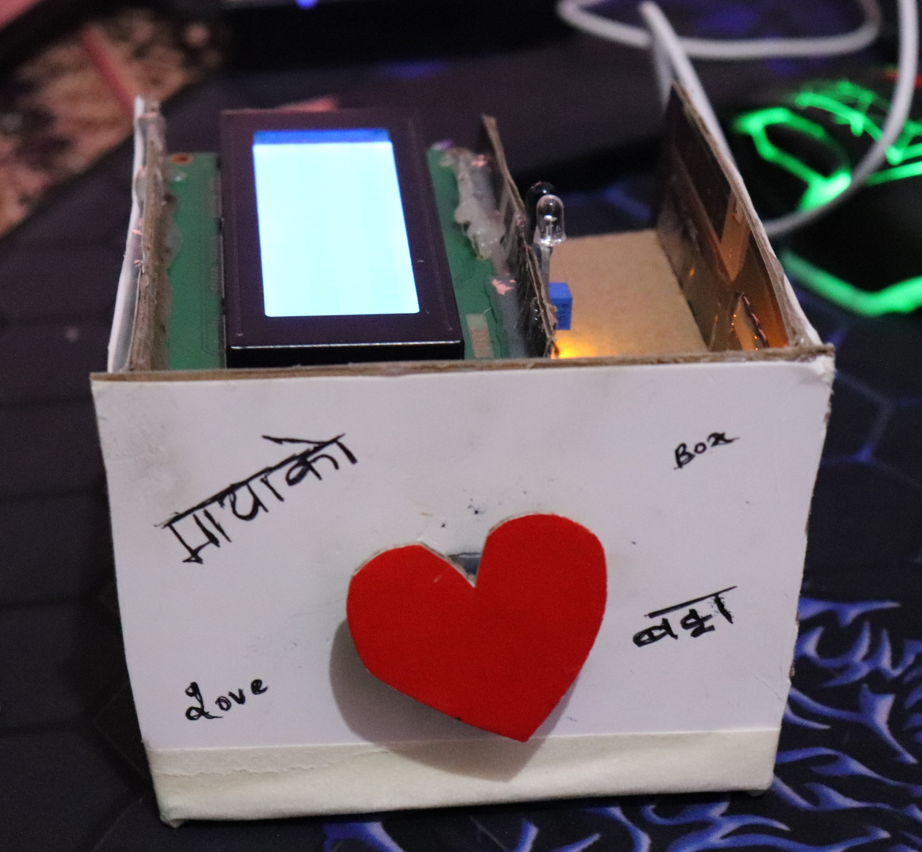

# love-box

An IoT based DIY project, love-box inspired from https://en.lovebox.love/. The love-box will make you and your loved ones happier by sharing special affections.

# Summary

Nobody expects to receive love notes by text every morning, but everyone loves receiving sweet notes on their Lovebox when they wake up! ;)

# So how it works?

1 -> Send messages to the Lovebox through an app.
2 -> The love box receives your message at the other end.
3 -> The heart of the Lovebox immediately rotates when your loved one gets a message (on the other end). It continues rotating until your loved one opens the box and reads the message.
4 -> Your loved one can then close the box and wait until next message ;)

# Technical aspects

- Raspberry Pi 3 A+ is used as a controller.
- A servo motor is used to rotate the heart, ir sensor to detect opening of love-box LED and a display to show messages.
- A python framework 'Flask' is used to create an API for receiving messages. Also serving html pages to the front end is done using Flask.
- On the front end, all core technologies like HTML, CSS and JS along with some SaSS are used. BEM class names can also be discovered in this project.

Feel free to reach me for any queries related to this project <3 Keep spreading love <3
